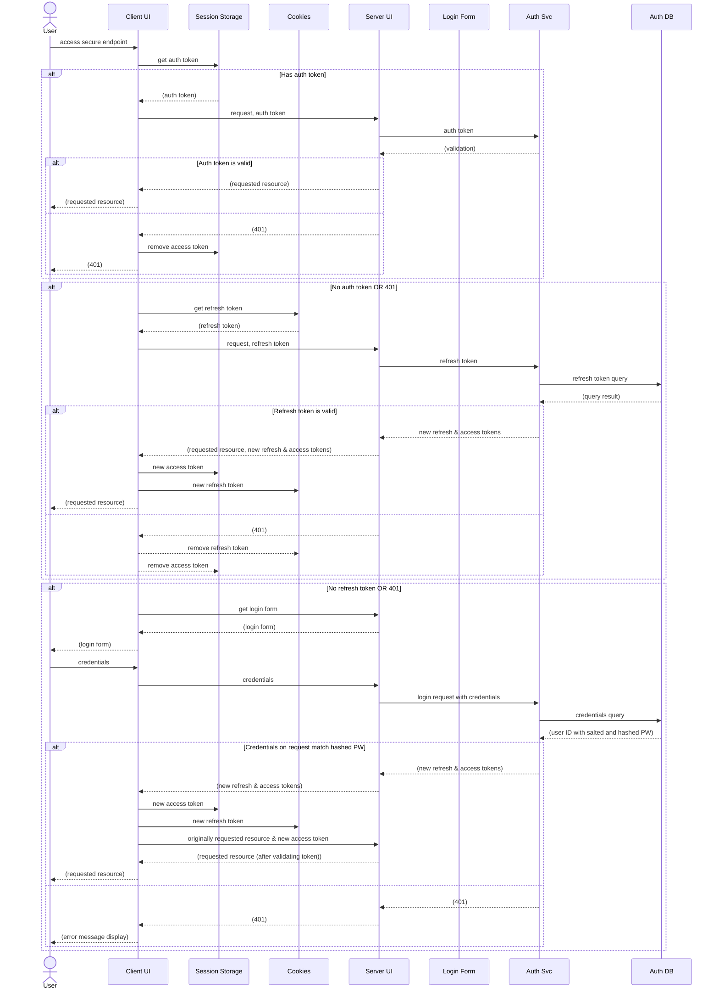

# Auth Sequence

```mermaid
sequenceDiagram
    actor User
    participant Client UI
    participant Session Storage
    participant Cookies
    participant Server UI
    participant Login Form
    participant Auth Svc
    participant Auth DB
    User->>Client UI: access secure endpoint
    Client UI->>Session Storage: get auth token
    alt Has auth token
        Session Storage-->>Client UI: (auth token)
        Client UI->>Server UI: request, auth token
        Server UI->>Auth Svc: auth token
        Auth Svc-->>Server UI: (validation)
        alt Auth token is valid
            Server UI-->>Client UI: (requested resource)
            Client UI-->>User: (requested resource)
        else
            Server UI-->>Client UI: (401)
            Client UI->>Session Storage: remove access token
            Client UI-->>User: (401)
        end
    end
    alt No auth token OR 401
        Client UI->>Cookies: get refresh token
        Cookies-->>Client UI: (refresh token)
        Client UI->>Server UI: request, refresh token
        Server UI->>Auth Svc: refresh token
        Auth Svc->>Auth DB: refresh token query
        Auth DB-->>Auth Svc: (query result)
        alt Refresh token is valid
            Auth Svc-->>Server UI: new refresh & access tokens
            Server UI-->>Client UI: (requested resource, new refresh & access tokens)
            Client UI->>Session Storage: new access token
            Client UI->>Cookies: new refresh token
            Client UI-->>User: (requested resource)
        else
            Server UI-->>Client UI: (401)
            Client UI-->>Cookies: remove refresh token
            Client UI-->>Session Storage: remove access token
        end
    end
    alt No refresh token OR 401
        Client UI->>Server UI: get login form
        Server UI-->>Client UI: (login form)
        Client UI-->>User: (login form)
        User->>Client UI: credentials
        Client UI->>Server UI: credentials
        Server UI->>Auth Svc: login request with credentials
        Auth Svc->>Auth DB: credentials query
        Auth DB-->>Auth Svc: (user ID with salted and hashed PW)
        alt Credentials on request match hashed PW
            Auth Svc-->>Server UI: (new refresh & access tokens)
            Server UI-->>Client UI: (new refresh & access tokens)
            Client UI->>Session Storage: new access token
            Client UI->>Cookies: new refresh token
            Client UI->>Server UI: originally requested resource &  new access token
            Server UI-->>Client UI: (requested resource (after validating token))
            Client UI-->>User: (requested resource)
        else
            Auth Svc-->>Server UI: (401)
            Server UI-->>Client UI: (401)
            Client UI-->>User: (error message display)
        end
    end
```
