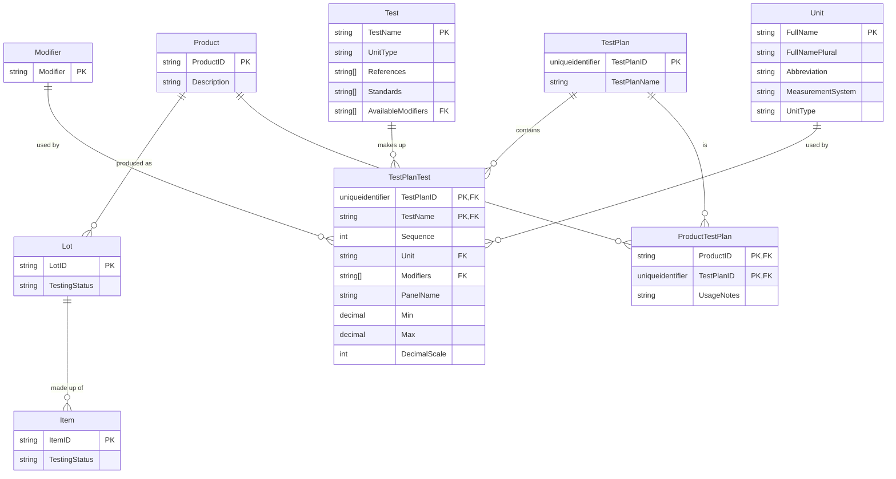

# ERD 

# Lists
## Unit Types
|Unit Type|Default Units|
|-|-|
|Count|ea|
|Length|nm, µm, mm, cm, m, km, in, ft, yd, mi|
|Area|mm², cm², m², km², in², ft², yd², mi²|
|Volume|mm³, cm³, m³, km³, in³, ft³, yd³, mi³|
|Speed|m/s, km/h, mph|
|Acceleration|ft/s², m/s², km/h², mi/h²|
|Weight|lb, oz, N, kN|
|Mass|g, kg|
|Weight or Mass Informally|g, kg, lb, oz|
|Pressure|lb/in², psi, Pa, kPa, MPa, GPa|

## Units
|Abbreviation|Singular Name|Plural Name|
|-|-|-|
|ea|each|each|
|nm|nanometer|nanometers|
|µm|micrometer|micrometers|
|mm|millimeter|millimeters|
|cm|centimeter|centimeters|
|m|meter|meters|
|km|kilometer|kilometers|
|in|inch|inches|
|ft|foot|feet|
|yd|yard|yards|
|mi|mile|miles|
|mm²|square millimeter|square millimeters|
|cm²|square centimeter|square centimeters|
|m²|square meter|square meters|
|km²|square kilometer|square kilometers|
|in²|square inch|square inches|
|ft²|square foot|square feet|
|yd²|square yard|square yards|
|mi²|square mile|square miles|
|mm³|cubic millimeter|cubic millimeters|
|cm³|cubic centimeter|cubic centimeters|
|m³|cubic meter|cubic meters|
|km³|cubic kilometer|cubic kilometers|
|in³|cubic inch|cubic inches|
|ft³|cubic foot|cubic feet|
|yd³|cubic yard|cubic yards|
|mi³|cubic mile|cubic miles|
|m/s|meter per second|meters per second|
|km/h|kilometer per hour|kilometers per hour|
|mph|mile per hour|miles per hour|
|ft/s²|foot per second squared|feet per second squared|
|m/s²|meter per second squared|meters per second squared|
|km/h²|kilometer per hour squared|kilometers per hour squared|
|mi/h²|mile per hour squared|miles per hour squared|
|g|gram|grams|
|kg|kilogram|kilograms|
|lb|pound|pounds|
|oz|ounce|ounces|
|N|newton|newtons|
|kN|kilonewton|kilonewtons|
|lb/in²|pound per square inch|pounds per square inch|
|psi|pound per square inch|pounds per square inch|
|Pa|pascal|pascals|
|kPa|kilopascal|kilopascals|
|MPa|megapascal|megapascals|
|GPa|gigapascal|gigapascals|