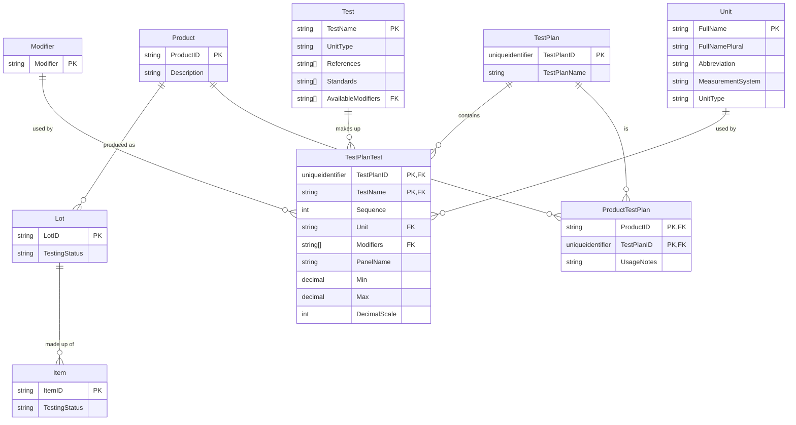

```mermaid
erDiagram
    Product {
        string ProductID PK
        string Description
    }
    Lot {
        string LotID PK
        string TestingStatus
    }
    Product ||--o{ Lot: "produced as"
    Item {
        string ItemID PK
        string TestingStatus
    }
    Lot ||--o{ Item: "made up of"
    Modifier {
        string Modifier PK
    }
    Test {
        string TestName PK
        string UnitType
        string[] References
        string[] Standards
        string[] AvailableModifiers FK
    }
    TestPlan {
        uniqueidentifier TestPlanID PK
        string TestPlanName
    }
    Unit {
        string FullName PK
        string FullNamePlural
        string Abbreviation
        string MeasurementSystem
        string UnitType
    }
    TestPlanTest {
        uniqueidentifier TestPlanID PK,FK
        string TestName PK,FK
        int Sequence
        string Unit FK
        string[] Modifiers FK
        string PanelName
        decimal Min
        decimal Max
        int DecimalScale
    }
    Modifier ||--o{ TestPlanTest: "used by"
    TestPlan ||--o{ TestPlanTest: contains
    Test ||--o{ TestPlanTest: "makes up"
    Unit ||--o{ TestPlanTest: "used by"
    ProductTestPlan {
        string ProductID PK,FK
        uniqueidentifier TestPlanID PK,FK
        string UsageNotes
    }
    TestPlan ||--o{ ProductTestPlan: is
    Product ||--o{ ProductTestPlan: has

```
