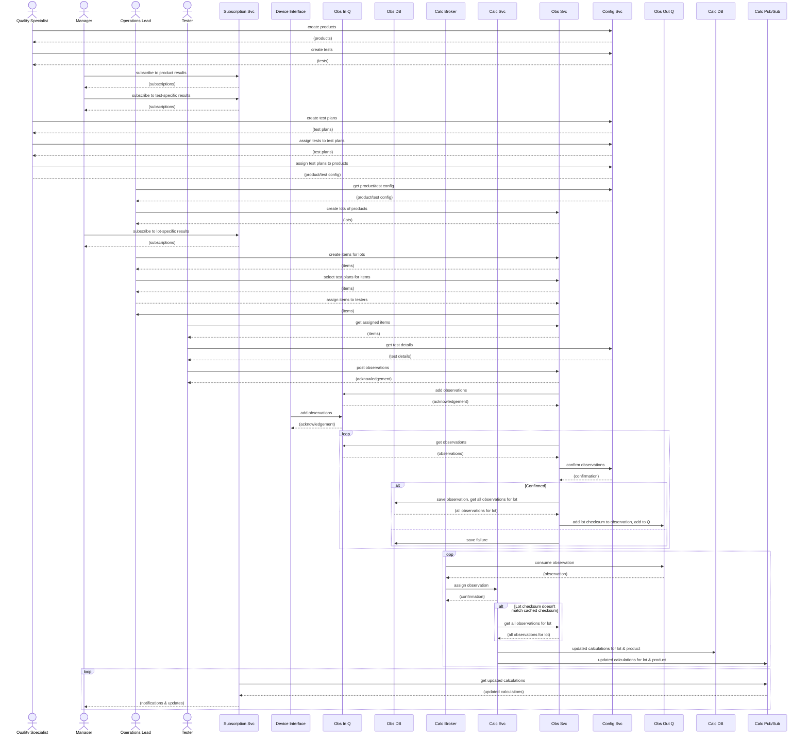

# Process Overview Sequence

```mermaid
sequenceDiagram
    actor Quality Specialist
    actor Manager
    actor Operations Lead
    actor Tester
    participant Subscription Svc
    participant Device Interface
    participant Obs In Q
    participant Obs DB
    participant Calc Broker
    participant Calc Svc
    participant Obs Svc
    participant Config Svc
    participant Obs Out Q
    Quality Specialist->>Config Svc: create products
    Config Svc-->>Quality Specialist: (products)
    Quality Specialist->>Config Svc: create tests
    Config Svc-->>Quality Specialist: (tests)
    Manager->>Subscription Svc: subscribe to product results
    Subscription Svc-->>Manager: (subscriptions)
    Manager->>Subscription Svc: subscribe to test-specific results
    Subscription Svc-->>Manager: (subscriptions)
    Quality Specialist->>Config Svc: create test plans
    Config Svc-->>Quality Specialist: (test plans)
    Quality Specialist->>Config Svc: assign tests to test plans
    Config Svc-->>Quality Specialist: (test plans)
    Quality Specialist->>Config Svc: assign test plans to products
    Config Svc-->Quality Specialist: (product/test config)
    Operations Lead->>Config Svc: get product/test config
    Config Svc-->>Operations Lead: (product/test config)
    Operations Lead->>Obs Svc: create lots of products
    Obs Svc-->>Operations Lead: (lots)
    Manager->>Subscription Svc: subscribe to lot-specific results
    Subscription Svc-->>Manager: (subscriptions)
    Operations Lead->>Obs Svc: create items for lots
    Obs Svc-->>Operations Lead: (items)
    Operations Lead->>Obs Svc: select test plans for items
    Obs Svc-->>Operations Lead: (items)
    Operations Lead-->>Obs Svc: assign items to testers
    Obs Svc->>Operations Lead: (items)
    Tester->>Obs Svc: get assigned items
    Obs Svc-->>Tester: (items)
    Tester->>Config Svc: get test details
    Config Svc-->>Tester: (test details)
    Tester->>Obs Svc: post observations
    Obs Svc-->>Tester: (acknowledgement)
    Obs Svc->>Obs In Q: add observations
    Obs In Q-->>Obs Svc: (acknowledgement)
    Device Interface->>Obs In Q: add observations
    Obs In Q-->>Device Interface: (acknowledgement)
    loop
        Obs Svc->>Obs In Q: get observations
        Obs In Q-->>Obs Svc: (observations)
        Obs Svc->>Config Svc: confirm observations
        Config Svc-->>Obs Svc: (confirmation)
        alt Confirmed
            Obs Svc->>Obs DB: save observation, get all observations for lot
            Obs DB-->>Obs Svc: (all observations for lot)
            Obs Svc->>Obs Out Q: add lot checksum to observation, add to Q
        else
            Obs Svc->>Obs DB: save failure
        end
    end
    loop
        Calc Broker->>Obs Out Q: consume observation
        Obs Out Q-->>Calc Broker: (observation)
        Calc Broker->>Calc Svc: assign observation
        Calc Svc-->>Calc Broker: (confirmation)
        alt Lot checksum doesn't match cached checksum
            Calc Svc->>Obs Svc: get all observations for lot
            Obs Svc-->>Calc Svc: (all observations for lot)
        end
        Calc Svc->>Calc DB: updated calculations for lot & product
        Calc Svc->>Calc Pub/Sub: updated calculations for lot & product
    end
    loop
        Subscription Svc->>Calc Pub/Sub: get updated calculations
        Calc Pub/Sub-->>Subscription Svc: (updated calculations)
        Subscription Svc-->>Manager: (notifications & updates)
    end


```
