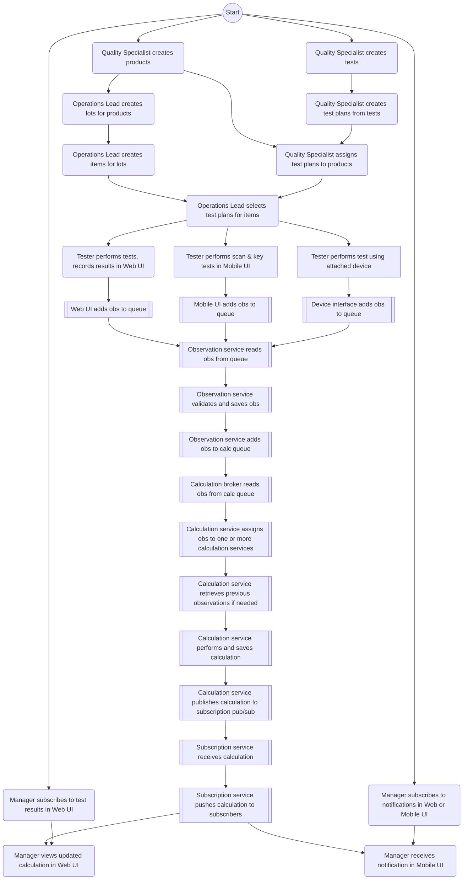

# QMEssentials process overview

```mermaid
flowchart TD
    M0010((Start))
    M0010-->M0020(Quality Specialist creates products)
    M0010-->M0030(Quality Specialist creates tests)
    M0030-->M0040(Quality Specialist creates test plans from tests)
    M0020-->M0050(Quality Specialist assigns test plans to products)
    M0040-->M0050
    M0020-->M0110(Operations Lead creates lots for products)
    M0010-->M0220(Manager subscribes to test results in Web UI)
    M0010-->M0230(Manager subscribes to notifications in Web or Mobile UI)
    M0110-->M0310(Operations Lead creates items for lots)
    M0310-->M0320(Operations Lead selects test plans for items)
    M0050-->M0320
    M0320-->M0410(Tester performs tests, records results in Web UI)
    M0410-->M0510[[Web UI adds obs to queue]]
    M0320-->M0420[Tester performs scan & key tests in Mobile UI]
    M0420-->M0520[[Mobile UI adds obs to queue]]
    M0320-->M0430[Tester performs test using attached device]
    M0430-->M0530[[Device interface adds obs to queue]]
    M0510-->M0540[[Observation service reads obs from queue]]
    M0520-->M0540
    M0530-->M0540
    M0540-->M0550[[Observation service validates and saves obs]]
    M0550-->M0560[[Observation service adds obs to calc queue]]
    M0560-->M0610[[Calculation broker reads obs from calc queue]]
    M0610-->M0620[[Calculation service assigns obs to one or more calculation services]]
    M0620-->M0630[[Calculation service retrieves previous observations if needed]]
    M0630-->M0640[[Calculation service performs and saves calculation]]
    M0640-->M0650[[Calculation service publishes calculation to subscription pub/sub]]
    M0650-->M0710[[Subscription service receives calculation]]
    M0710-->M0720[[Subscription service pushes calculation to subscribers]]
    M0720-->M0730(Manager views updated calculation in Web UI)
    M0220-->M0730
    M0720-->M0740(Manager receives notification in Mobile UI)
    M0230-->M0740

```
